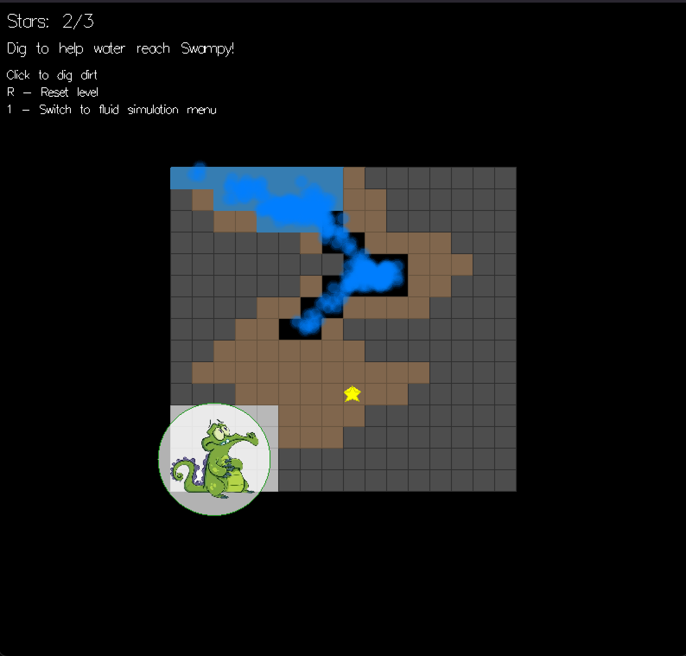

# FluidSimulation
Fluid simulation on Haskell, you can adjust parameters of fluid and interact with it via cursor (need to click and hold). We use Smoothed particle hydrodynamics (SPH) for physics simulation.


**Also a level of Swampy the alligator game is avaliable:**



## Getting started
Clone repository
```
git clone https://github.com/IzyumovMaxim/FluidSimulation
```
Execute program
```
cd FluidSimulation
stack build
stack exec -- sph-fluid -- +RTS -N8 -s -RTS
```

## User guide


## File structure
```
fluid-simulation/
├── src/
│   ├── assets/
│   └── i.png         -- Swampy image🐊
│   ├── Physics.hs    -- SPH calculations
│   ├── Types.hs      -- Data types
│   ├── Level.hs      -- Game level with fluid-based puzzle
│   ├── Render.hs     -- Gloss visualization
│   └── Main.hs       -- Entry point
├── app.cabal         -- Build config
└── stack.yaml        -- Stack config
```

## ChangeLog
**Stage I**
- Basic 2D visualisation and modelling;
- One scene with some shape containing the fluid;
- Easily configurable model (via coefficients and kernel functions).
  
**Stage II**
- Improved physics (added surface tension);
- Several fluid simulation scenes: sware, circle, hourglass, windmill;
- Added one level of game mode: "Where Is My Water?", as a simple fluid-based puzzle;
- Included optimizations.
  
