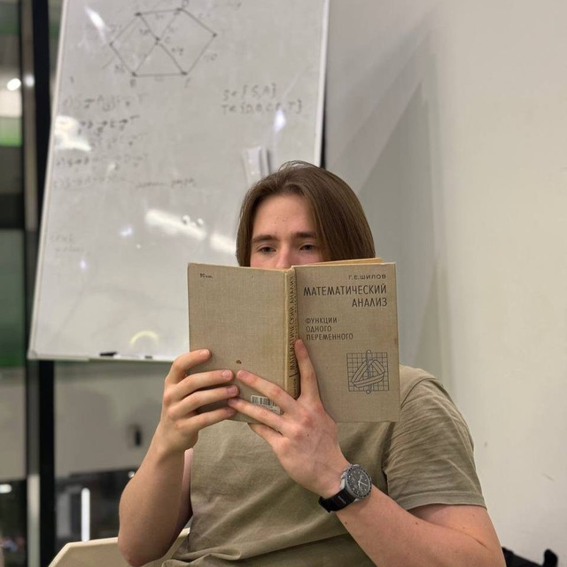
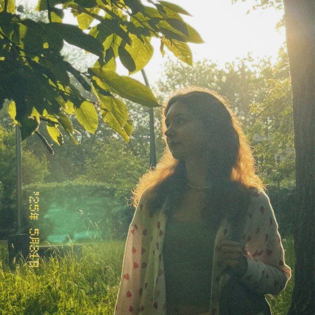

# FluidSimulation
A real-time fluid simulation written in Haskell, using Smoothed Particle Hydrodynamics (SPH) for physics modeling. You can interact with the fluid by clicking and dragging the mouse—adjust simulation parameters on the fly for a customizable experience.

[👉View Simulation Demo](footage/scene_record.mov)

## 👥 Contributors
<table>
  <tr>
    <td align="center" width="250px">
      <a href="https://github.com/IzyumovMaxim">
        
        <div>Maxim Izyumov</div>
      </a>
    </td>
    <td align="center" width="250px">
      <a href="https://github.com/RII6">
        
        <div>Albert Khechoyan</div>
      </a>
    </td>
    <td align="center" width="250px">
      <a href="https://github.com/ashuno">
        
        <div>Irina Perekrestova</div>
      </a>
    </td>
  </tr>
  <tr>
    <td align="center">
      <div>Computations Optimization</div>
    </td>
    <td align="center">
      <div>Complex Environments</div>
    </td>
    <td align="center">
      <div>Fluid-based Puzzle</div>
    </td>
  </tr>
</table>


## 🚀Getting started
Clone repository
```
git clone https://github.com/IzyumovMaxim/FluidSimulation
```
Execute program
```
cd FluidSimulation
stack build
stack exec -- sph-fluid -- +RTS -N8 -s -RTS
```

## 🎮User guide
**Explore different simulation scenarios and our game mode!**
<p align="left">


</p>


- **Game mode control keys:** 
  - 1 - Square fluid simulation
  - 2 - Hourglass fluid simulation
  - 3 - Ball fluid simulation
  - 4 - Windmill simulation
  - 5 - Puzzle Level (Where's My Water)

- **Fluid Simulation Controls:**
  - R - Reset simulation
  - Arrow keys - Adjust gravity
  - T/G - Mass up/down
  - U/J - Stiffness up/down
  - I/K - Viscosity up/down
  - P/; - Surface tension up/down
  - Q/q - Smoothing radius (affects performance)
  - W/w - Add/remove particles
  - Hold Shift for larger adjustments
  - Click and drag to interact with particles

- **Puzzle Game Controls:**
  - Click - Dig dirt blocks
  - R - Reset level
  - Goal: Collect all stars and get water to Swampy!


## 📁Project structure
```
fluid-simulation/
├── src/
│   ├── assets/
│   └── i.png         -- Swampy image🐊
│   ├── Physics.hs    -- SPH calculations
│   ├── Types.hs      -- Data types
│   ├── Level.hs      -- Game level with fluid-based puzzle
│   ├── Render.hs     -- Gloss visualization
│   └── Main.hs       -- Entry point
├── app.cabal         -- Build config
└── stack.yaml        -- Stack config
```

## 📝 ChangeLog
**Stage I**
- Basic 2D visualisation and modelling;
- One scene with some shape containing the fluid;
- Easily configurable model (via coefficients and kernel functions).
  
**Stage II**
- Improved physics (added surface tension);
- Several fluid simulation scenes: sware, circle, hourglass, windmill;
- Added one level of game mode: "Where Is My Water?", as a simple fluid-based puzzle;
- Optimizations enabled:
  - Parallel computation (4 cores)
  - Vectorized operations
  - Optimized spatial grid
  - Reduced memory allocations

  
